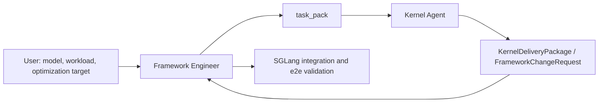

# Kernel Agent Phase 1: Framework Engineer 与 Task Pack 设计说明

本文总结当前 Phase 1 的实现思路、Framework Engineer 的职责和使用流程，以及 `task_pack/` 的结构与 Kernel Agent 使用方式。

当前阶段已经优先跑通单目标优化流程：Framework Engineer 针对一个明确 target 接口，从真实框架 workload 中捕获 snapshot，生成可 replay 的 correctness/benchmark task pack；Kernel Agent 后续只围绕 task pack 中的 `candidate_impl.py` 和 `kernel_sources/` 做实现与优化。

## 1. 分角色整体设计

Phase 1 的核心设计是把模型/框架侧问题和算子实现侧问题拆开。



### Framework Engineer

Framework Engineer 面向模型、框架和真实 workload。它负责把模型中的性能问题转化为明确、可重放、可验证的 kernel 优化任务。

它的核心产物不是手写 kernel，而是 `task_pack/`：

- 真实输入 snapshot。
- 可离开服务运行的 replay runtime。
- correctness test。
- benchmark harness。
- 环境能力说明。
- 原始目标源码参考。
- kernel 侧必须遵守的 ABI 和禁止修改项。

### Kernel Agent

Kernel Agent 面向算子、硬件、DSL 和 profiler。它不需要理解完整模型，也不应该猜测 `ForwardBatch`、metadata、state/cache 等框架对象如何构造。

它只消费 Framework Engineer 给出的 `task_pack/`：

- 读取 ABI、snapshot、环境和 benchmark 规则。
- 判断任务是否可接受。
- 在 `candidate_impl.py` 或 `kernel_sources/` 中实现优化。
- 循环执行 correctness、benchmark、profile、修改。
- 若需要框架配合，输出正式 `FrameworkChangeRequest`。
- 达标后输出 `KernelDeliveryPackage`。

### 边界原则

- Framework Engineer 负责真实输入和真实场景。
- Kernel Agent 负责 candidate kernel 的性能优化。
- `selected snapshots` 是 UT/benchmark 的唯一 replay 来源。
- `shape_list.json` 只是摘要索引，不能被当作随机造输入的依据。
- golden 默认来自当前框架实现或 captured snapshot，不默认要求 PyTorch golden。
- 如果单 kernel 变快但端到端无收益，解释原因属于 Framework Engineer 的验收职责。

## 2. Framework Engineer 的职责

当前 Phase 1 中，Framework Engineer 至少需要负责以下工作。

### 2.1 用户 Gate

任务启动前必须确认：

- 服务启动命令可运行。
- workload/test 命令可运行。
- 优化目标至少明确到 module forward 或具体 target 接口。
- 如果要按 forward window 分组 snapshot，需要能定位一个高层 forward boundary。

如果这些条件不满足，Framework Engineer 应该直接中断并给出明确错误，而不是替用户修服务环境、数据集或 workload。

### 2.2 目标确认

如果用户只给了 module 级目标，Framework Engineer 需要阅读框架代码，把目标收敛到可捕获、可 replay 的 Python 可见接口。

例如 Qwen3.5 linear attention 中，很多输入来自 SGLang 内部对象：

- `ForwardBatch`
- metadata
- `query_start_loc`
- cache pool
- state/cache tensor
- prefill/decode 分支

Framework Engineer 需要决定最终 task pack 捕获哪一层接口。Phase 1 更适合优先捕获 tensor-level 或接近 tensor-level 的 core function/free function，因为这类接口更容易 replay。

### 2.3 真实输入负责

Framework Engineer 必须对 UT/benchmark 的输入负责：

- 不用随机 shape 伪造框架输入。
- 不让 Kernel Agent 猜测 metadata/cache/state 的构造方式。
- 从真实 workload 中 capture `pre_inputs`、`post_inputs`、`outputs`。
- 如果接口会原地修改输入，需要在 `mutable_arg_paths` 中声明，并在 correctness 中比较 post-state。

### 2.4 Snapshot 选择与收敛

当前实现采用 forward-windowed shape group 的设计：

- 高层 forward boundary decorator 生成 `forward_id`。
- target wrapper 捕获每次目标接口调用，并读取当前 `forward_id`。
- `group_key` 只看 target、tree 结构、shape、dtype、stride/layout、primitive、None/presence。
- 同一 group 记录 `total_hit_count` 和 `forward_hit_count`。
- 每个 group 保留有限 sample，用于让 Kernel Agent 观察真实参数分布。
- selector 按高频 group 选择 selected snapshots。

这个设计刻意不做 kernel-aware semantic hash。原因是不同 kernel 对 `cu_seqlens`、`query_start_loc`、`chunk_indices`、`paged_block_id` 等值的敏感性不同，Framework Engineer 很难标准化判断哪些 tensor value 应该参与聚类。

### 2.5 Harness 和环境合同

Framework Engineer 需要生成：

- `snapshot_runtime.py`
- `reference_impl.py`
- `candidate_impl.py`
- `correctness_test.py`
- `benchmark.py`
- `scripts/run_correctness.sh`
- `scripts/run_benchmark.sh`
- `scripts/run_ncu.sh`
- `env_manifest.yaml`
- `original_source/`
- `original_impl.py`

其中 `original_source/` 是源码参考，`original_impl.py` 是 linked replay 入口。运行时如果 linked original 不可用，task pack 仍然有效，可以先使用 snapshot-golden correctness 和 candidate-only benchmark。

## 3. Framework Engineer 使用流程与实现细节

当前 CLI 入口是：

```bash
python -m kernel_agent.framework_engineer.cli <subcommand>
```

推荐单目标流程如下。

### 3.1 scaffold-task-pack

创建初始 task pack 目录。

```bash
python -m kernel_agent.framework_engineer.cli scaffold-task-pack \
  --task-id qwen35_linear_core \
  --out /path/to/task_pack
```

主要工作：

- 创建 `docs/`、`scripts/`、`snapshots/raw/`、`snapshots/selected/`、`env_probe/`、`kernel_sources/`、`original_source/`。
- 拷贝初始 `README.md`、`task.yaml`、`env_manifest.yaml`。
- 写入空的 `snapshots/manifest.json` 和 `shape_list.json`。

标准化点：

- 后续所有 CLI 都围绕同一个 `task_pack/` 工作。
- `task_pack/` 是 Framework Engineer 和 Kernel Agent 的交接边界。

### 3.2 run-baseline

启动用户服务，运行 workload，记录 baseline。

```bash
python -m kernel_agent.framework_engineer.cli run-baseline \
  --task-pack /path/to/task_pack \
  --service-cmd "<service command>" \
  --workload-cmd "<workload command>"
```

输出：

- `docs/baseline_result.json`
- `docs/baseline_run_report.md`

标准化点：

- baseline 是端到端收益判断的起点。
- Phase 1 不自动判断热点，但至少记录当前 workload 是否能稳定运行。

### 3.3 resolve-interface

根据文件和行号解析目标接口。

```bash
python -m kernel_agent.framework_engineer.cli resolve-interface \
  --file /path/to/source.py \
  --line 123
```

输出包含：

- `target_file`
- `function_name`
- `target_name`
- `class_path`
- `module_name`
- `line`
- `end_line`

标准化点：

- 用户可以只提供 `target_file + target_line`。
- CLI 通过 AST 自动定位函数、类方法或嵌套 class method。
- 避免用户手写 `sglang.xxx.Class.method` 时出错。

### 3.4 probe-target-calls

验证 target 在 workload 中确实被调用。

```bash
python -m kernel_agent.framework_engineer.cli probe-target-calls \
  --task-pack /path/to/task_pack \
  --service-cmd "<service command>" \
  --workload-cmd "<workload command>" \
  --target-file /path/to/source.py \
  --target-line 123 \
  --forward-boundary-file /path/to/model.py \
  --forward-boundary-line 456
```

主要工作：

- 临时插桩目标接口。
- 可选插桩 forward boundary。
- 在 non-cudagraph 配置下运行 workload。
- 记录调用次数、调用参数数量、kwargs 数量、forward_id 等信息。

输出：

- `docs/target_call_probe.jsonl`
- `docs/target_call_probe_report.json`
- `docs/target_call_probe_report.md`

标准化点：

- `probe-target-calls` 是 capture 前的安全检查。
- 如果目标接口没有被调用，说明目标定位或 workload 不对，不应该继续 capture。
- `--non-cudagraph-service-cmd` 可覆盖默认追加 `--disable-cuda-graph` 的策略。

### 3.5 capture-snapshots

捕获 raw snapshots。

```bash
python -m kernel_agent.framework_engineer.cli capture-snapshots \
  --task-pack /path/to/task_pack \
  --service-cmd "<service command>" \
  --workload-cmd "<workload command>" \
  --target-file /path/to/source.py \
  --target-line 123 \
  --forward-boundary-file /path/to/model.py \
  --forward-boundary-line 456 \
  --signature "candidate(*args, **kwargs)" \
  --max-capture-groups 64 \
  --max-samples-per-group 8 \
  --max-samples-per-forward-per-group 3
```

可选：

```bash
--mutable-arg-path kwargs.ssm_states
```

主要工作：

- 捕获目标接口的 `pre_inputs`。
- 调用原始函数。
- 捕获 `outputs`。
- 捕获调用后的 `post_inputs`。
- 将 raw snapshot 写入 group/sample 目录。
- 记录每个 group 的 hit count 和 sample 上限信息。

输出：

```text
snapshots/raw_index.json
snapshots/raw/group_xxx/sample_xxxx/
  meta.json
  pre_inputs.pt
  post_inputs.pt
  outputs.pt
docs/snapshot_capture_report.json
```

标准化点：

- snapshot 捕获支持 tensor、primitive、list、tuple、dict、None。
- BF16 tensor 的 value hash 不能直接走 numpy，当前实现已有 fallback。
- `mutable_arg_paths` 不是必填项。误填不存在的 path 不会中断 capture，会记录 warning 并忽略该 path。

### 3.6 select-snapshots

从 raw snapshots 收敛到 selected snapshots。

```bash
python -m kernel_agent.framework_engineer.cli select-snapshots \
  --task-pack /path/to/task_pack \
  --max-groups 8 \
  --max-selected-samples-per-group 8
```

主要工作：

- 读取 `snapshots/raw_index.json`。
- 按 `total_hit_count`、group 频率和 sample 上限选择高频 case。
- 写入 selected group/sample 结构。
- 生成 `snapshots/manifest.json`。
- 派生 `shape_list.json` 摘要。

输出：

```text
snapshots/manifest.json
snapshots/selected/group_xxx/
  group_meta.json
  samples/sample_xxxx/
    meta.json
    pre_inputs.pt
    post_inputs.pt
    outputs.pt
shape_list.json
docs/snapshot_selection_report.json
docs/snapshot_selection_report.md
```

标准化点：

- selected snapshots 是唯一 replay 来源。
- `shape_list.json` 只给 Kernel Agent 快速理解 shape 分布，不参与构造输入。

### 3.7 generate-harness

生成 correctness/benchmark harness。

```bash
python -m kernel_agent.framework_engineer.cli generate-harness \
  --task-pack /path/to/task_pack
```

主要工作：

- 复制最小 snapshot replay runtime 到 task pack。
- 生成 linked `original_impl.py`。
- 复制目标源码到 `original_source/` 作为参考。
- 生成 `reference_impl.py`、`candidate_impl.py`。
- 生成 `correctness_test.py`、`benchmark.py`。
- 生成 `scripts/run_correctness.sh`、`scripts/run_benchmark.sh`、`scripts/run_ncu.sh`。

关于 original 的当前策略：

- `original_source/` 复制目标接口所在源码，供 Kernel Agent 阅读。
- `original_impl.py` 不从复制源码执行，而是 linked import 原框架环境中的真实接口。
- 如果 linked original 可用，`original_source/manifest.json` 中 `executable=true`。
- 如果 linked original 不可用，例如缺少 SGLang/vLLM 环境或目标是无法重建 `self` 的 instance method，仍保留源码参考。
- benchmark 支持 `TARGET=candidate` 只跑 candidate。

标准化点：

- task pack 不强行封装整个 SGLang/vLLM 依赖链。
- 运行原始实现时走真实框架接口。
- 离开框架环境后，Kernel Agent 仍可阅读源码和 replay snapshots。

### 3.8 probe-env

探测开发环境能力。

```bash
python -m kernel_agent.framework_engineer.cli probe-env \
  --task-pack /path/to/task_pack
```

当前探测项包括：

- Python 基础信息。
- PyTorch/CUDA 基础可用性。
- Triton probe。
- CuTe DSL probe。
- CUDA extension probe。
- NCU probe。

输出：

- `env_manifest.yaml`
- `docs/env_probe_result.json`
- `env_probe/probe_*.py`
- `env_probe/probe_ncu.sh`

标准化点：

- Kernel Agent 通过 `env_manifest.yaml` 选择实现路径。
- 当前不会强制限制 CuTe DSL，只要环境可用即可作为候选实现路径。
- CUDA/CUTLASS 等非 JIT 实现可以作为遇到瓶颈后的升级路径。

### 3.9 validate-task-pack

验证 task pack 完整性和 smoke test。

```bash
python -m kernel_agent.framework_engineer.cli validate-task-pack \
  --task-pack /path/to/task_pack \
  --skip-env-check \
  --run-correctness \
  --run-benchmark
```

主要工作：

- 检查必需文件是否存在。
- 检查 `snapshots/manifest.json` 是否有 selected case groups。
- 检查 selected snapshot 文件是否完整。
- 可选重新跑环境探测并比较环境一致性。
- 可选运行 correctness smoke。
- 可选运行 benchmark smoke。

输出：

- `docs/task_pack_validation_report.json`

标准化点：

- Framework Engineer 交付前必须至少跑 correctness smoke。
- 如果 linked original 不可用，benchmark 可使用 candidate-only 模式。
- 如果 task pack 初始就无法 replay，需要先由 Framework Engineer 修复，不应该让 Kernel Agent 修改 harness 或 snapshot。

## 4. 当前实现如何标准化各功能

### 4.1 Source Interface 标准化

当前通过 `target_file + target_line` 定位接口，CLI 自动解析：

- function name
- qualified name
- class path
- module name
- begin/end line

这比手工填写 `function_name` 和 `target_name` 更稳，尤其适合 SGLang 这种深目录、多类方法的代码结构。

### 4.2 Forward Boundary 标准化

capture 时可以在更高层模型 forward、runner 或 backend forward 插入 boundary decorator。

boundary decorator 负责生成 `forward_id`，目标接口 wrapper 捕获 snapshot 时读取当前 `forward_id`。

这比配置固定的 `calls_per_forward` 更稳，因为 SGLang 的调度、prefill/decode 分支和 batch 形态可能改变 target call 数量。

### 4.3 Snapshot 数据模型标准化

当前核心数据对象包括：

- `SnapshotTensorMeta`：记录 tensor path、dtype、shape、stride、storage_offset、device、contiguous、numel。
- `SnapshotCase`：记录 target、args/kwargs/output tree、pre/post/output 文件、mutable paths、hashes、selection、tolerance。
- `SnapshotStore`：负责 raw/selected snapshot 读写。
- `SnapshotRecorder`：装饰器内捕获 pre inputs、outputs、post inputs。
- `SnapshotSelector`：按 group/hit count 选择 selected snapshots。
- `SnapshotHarnessBuilder`：生成 task pack harness。

### 4.4 Group/Sample 标准化

Raw snapshot 不再是一维 case 列表，而是：

```text
snapshots/raw/group_xxx/sample_xxxx/
```

Selected snapshot 也是：

```text
snapshots/selected/group_xxx/samples/sample_xxxx/
```

其中：

- group 表示同一类 target 调用。
- sample 表示该 group 下保留的真实输入样本。
- hit count 用于选择高频 group。
- 多 sample 用于帮助 Kernel Agent 理解真实数据分布。

### 4.5 Harness ABI 标准化

当前 harness 使用通用 ABI：

```python
candidate(*args, **kwargs)
```

不再生成 `candidate_extend` 这类特定 ABI。

优点：

- 支持不同 target function 的动态参数。
- 支持 free function、staticmethod、部分 class method。
- 不要求 Framework Engineer 为每个 kernel 手写 harness。

限制：

- 如果原始目标是 instance method，且语义依赖 `self` 内部状态，task pack 默认不会 dump `self`。这种情况下 linked original 可能不可执行，但 snapshot-golden correctness 仍可用。
- Kernel Agent 的最终 candidate 应尽量收敛到 tensor-level 或显式参数 ABI。

### 4.6 Correctness 标准化

`correctness_test.py` 默认使用 snapshot-golden：

1. 加载 selected sample。
2. clone `pre_inputs` 给 reference 和 candidate。
3. expected outputs 使用 captured outputs。
4. candidate 输出与 expected 比较。
5. 对 `mutable_arg_paths` 中的输入比较 post-state。

可选 `reference-replay`：

```bash
CORRECTNESS_MODE=reference-replay bash scripts/run_correctness.sh
```

该模式要求 linked original 可执行。

### 4.7 Benchmark 标准化

`benchmark.py` 支持：

```bash
python benchmark.py --target reference
python benchmark.py --target candidate
python benchmark.py --target both
```

规则：

- 每轮 timed run 前恢复 mutable inputs 到 pre-state。
- reset/clone/copy 不计入 timed region。
- CUDA event timing 优先，CPU timer fallback。
- 输出 per-sample JSONL 和 group summary。
- `--target both` 中 reference 不可用时不会中断，会记录 unavailable 并继续跑 candidate。
- `--target reference` 要求 reference 可执行，否则明确失败。

## 5. Framework Engineer 待加强内容

### 5.1 多目标 task pack

当前实现按单 target task pack 工作。下一步需要支持：

- 一个模型模块中多个 target 接口同时 probe/capture。
- 每个 target 独立 group/sample/manifest。
- task pack 中多个 candidate entry。
- 多 target 的收益排序和依赖关系说明。

例如 Qwen3.5 linear attention 中可能同时优化：

- `chunk_gated_delta_rule_fwd_intra`
- `chunk_gated_delta_rule_fwd_h`
- `chunk_fwd_o`

这些接口可以共享同一个 workload 和 forward boundary，但 selected snapshots、candidate ABI、benchmark 结果需要分 target 组织。

### 5.2 更强的开发环境描述

当前 `probe-env` 已覆盖 Triton、CuTe DSL、CUDA extension、NCU 的基础可用性，但还可以加强：

- H20/SM 版本、shared memory、register、L2 等硬件细节。
- Triton 版本和 known issue。
- CuTe DSL 版本、支持的 arch、编译参数。
- CUDA extension include/library path。
- Nsight Compute 权限、可采集指标集、容器权限。
- 与 SGLang 当前 Python/CUDA/PyTorch ABI 的兼容性。

### 5.3 优化后算子接入

Phase 1 当前重点是 task pack 生成，不自动接入优化后 kernel。后续需要补：

- KernelDeliveryPackage 解析。
- framework integration plan。
- feature flag 和 fallback。
- SGLang backend 接入。
- 端到端性能验证。
- 精度/输出一致性验证。
- 无收益原因归因。

### 5.4 更真实的 profile 和热点选择

当前 baseline 只记录 workload 可运行和基础结果，未自动生成 top-K 热点。后续需要：

- torch profiler/nsys/ncu 的统一采集接口。
- hotspot report。
- Amdahl 上限估计。
- 调用频率、GPU time、接入风险综合排序。
- 自动生成 top-K KernelRequestSpec 或 task pack。

### 5.5 Snapshot capture 稳定性

后续可以继续加强：

- 更稳的源码插桩回滚机制。
- 服务异常中断后的恢复指令。
- 对不可 pickle / 不可 torch.save 对象的降级策略。
- 对大型 tensor 的采样、压缩或 external storage。
- 对异步 state update 的同步策略。
- 对 CUDA graph、distributed、multi-process serving 的支持。

### 5.6 审计和反作弊

Kernel Agent 优化后需要独立验证：

- fresh process replay。
- 随机 selected sample 顺序。
- candidate 不能读取 captured outputs 作弊。
- benchmark 多次重复和稳定性报告。
- reference/candidate 使用相同 warmup/repeat/timing 规则。

## 6. Task Pack 详细说明

当前 task pack 结构如下。

```text
task_pack/
  README.md
  task.yaml
  shape_list.json
  env_manifest.yaml
  snapshot_runtime.py
  snapshots/
    manifest.json
    raw_index.json
    raw/
    selected/
      group_xxx/
        group_meta.json
        samples/
          sample_xxxx/
            meta.json
            pre_inputs.pt
            post_inputs.pt
            outputs.pt
  original_source/
    manifest.json
    <copied_target_source>
  original_impl.py
  reference_impl.py
  candidate_impl.py
  correctness_test.py
  benchmark.py
  scripts/
    run_correctness.sh
    run_benchmark.sh
    run_ncu.sh
  env_probe/
    probe_triton.py
    probe_cutedsl.py
    probe_cuda_extension.py
    probe_ncu.sh
  docs/
    baseline_result.json
    baseline_run_report.md
    target_call_probe.jsonl
    target_call_probe_report.json
    target_call_probe_report.md
    snapshot_capture_report.json
    snapshot_selection_report.json
    snapshot_selection_report.md
    env_probe_result.json
    task_pack_validation_report.json
  kernel_sources/
```

### 6.1 `README.md`

面向 Kernel Agent 的快速说明。

说明：

- task pack 是 Framework Engineer 生成的。
- Kernel Agent 应该只优化 candidate。
- linked original 不可用时如何跑 candidate-only benchmark。
- 哪些文件可以改，哪些文件不能改。

### 6.2 `task.yaml`

任务合同。

内容包括：

- task id。
- 目标模型、框架、硬件。
- 优化目标。
- source entrypoints。
- candidate ABI。
- correctness 语义。
- mutable input 说明。
- 禁止修改项。
- 输入构造策略。
- correctness/benchmark/profile 命令。
- 成功标准。
- 允许的实现路径。
- kernel 侧交付物。

Kernel Agent 第一件事应该读 `task.yaml`，确认能否接受任务。

### 6.3 `shape_list.json`

selected snapshots 的摘要索引。

用途：

- 快速了解 group 数量。
- 快速了解 shape、dtype、layout 分布。
- 帮 Kernel Agent 决定优先优化哪些 hot group。

限制：

- 不能用它随机造输入。
- 不能把它当成 replay 数据源。
- 不能由 Kernel Agent 手工修改。

### 6.4 `env_manifest.yaml`

开发环境合同。

用途：

- 告诉 Kernel Agent 当前是否可用 Triton、CuTe DSL、CUDA extension、NCU。
- 帮助选择实现路径。
- 记录 Framework Engineer 生成 task pack 时的环境能力。

后续需要扩展为更完整的硬件、编译器、profiler、依赖版本合同。

### 6.5 `snapshot_runtime.py`

task pack 内自带的最小 replay runtime。

提供：

- 读取 `snapshots/manifest.json`。
- 枚举 selected groups/samples。
- 加载 sample payload。
- tree clone。
- tree to device。
- path get/set。
- mutable post-state apply。
- tree close assertion。

它必须自包含，不依赖 `kernel_agent.framework_engineer.snapshot` 源码。这样 Kernel Agent 拿到 task pack 后不需要 import Framework Engineer 工程。

### 6.6 `snapshots/manifest.json`

selected snapshots 的主 manifest。

内容包括：

- schema version。
- raw/selected group 数量。
- raw/selected sample 数量。
- selection policy。
- `case_groups`。

每个 case group 中包含：

- `group_id`
- target 信息。
- group key。
- hit count。
- shape/tree 摘要。
- samples。
- selection priority。

### 6.7 `snapshots/raw_index.json`

raw capture 的索引。

用途：

- 记录 raw groups。
- 记录 total hit count。
- 记录 forward hit count。
- 记录每个 group 保存了哪些 sample。

一般给 Framework Engineer 调试 capture/selection 使用，Kernel Agent 主要看 selected snapshots。

### 6.8 `snapshots/selected/`

Kernel Agent 实际 replay 的输入数据。

每个 sample 包含：

- `meta.json`
- `pre_inputs.pt`
- `post_inputs.pt`
- `outputs.pt`

语义：

- `pre_inputs.pt` 是调用 candidate 前的输入。
- `outputs.pt` 是原始目标接口的返回值。
- `post_inputs.pt` 是原始目标接口调用后的输入状态。
- `meta.json` 记录 tolerance、mutation、hash、source 等信息。

如果接口没有原地修改输入，correctness 只比较 outputs。

如果配置了有效 `mutable_arg_paths`，correctness 会同时比较 candidate 运行后的对应 post-state。

### 6.9 `original_source/`

原始目标源码参考。

当前策略：

- `generate-harness` 会尝试复制目标接口所在源码文件。
- `original_source/manifest.json` 记录复制状态、sha256、target info、linked original 可执行性。
- 复制源码只作为阅读参考，不作为默认执行路径。

这样做的原因：

- 直接把 SGLang/vLLM 的相关源码全部复制进 task pack 会遇到依赖链问题。
- 统一逻辑更简单：要执行原始实现，就调用框架里的真实接口。
- 离开框架环境时，Kernel Agent 仍然可以阅读原始实现。

### 6.10 `original_impl.py`

linked original replay 入口。

作用：

- 尝试 import capture 时的原框架 module。
- 尝试解析并调用原 target。
- 作为 `benchmark.py --target reference` 的 baseline。

限制：

- 如果原始目标是 instance method，且需要 framework-owned `self`，可能无法 replay。
- 如果当前环境没有 SGLang/vLLM，可能无法 import。
- 如果 linked original 不可用，不代表 task pack 无效。

### 6.11 `reference_impl.py`

reference 入口。

提供两条路径：

- `reference(...)`：调用 `original_impl.original(...)`。
- `snapshot_reference(...)`：返回 captured outputs，并应用 captured mutable post-state。

默认 correctness 使用 snapshot-golden fallback，因此不强依赖 linked original。

### 6.12 `candidate_impl.py`

Kernel Agent 的主要修改入口。

初始版本通常：

- 优先调用 linked original。
- linked original 不可用时 fallback 到 snapshot reference，保证初始 correctness smoke 可以通过。

Kernel Agent 接手后应该替换 `candidate(...)`，实现真正的优化 kernel 调用。

允许修改：

- `candidate_impl.py`
- `kernel_sources/`
- 自己生成的报告和 iteration log。

不允许修改：

- snapshots。
- `snapshot_runtime.py`。
- `reference_impl.py`。
- `correctness_test.py`。
- `benchmark.py`。
- tolerance。
- timing rules。

### 6.13 `correctness_test.py`

snapshot replay correctness harness。

常用命令：

```bash
bash scripts/run_correctness.sh
```

或：

```bash
python correctness_test.py --device cuda --mode snapshot-golden
```

支持：

- `--group-id`
- `--sample-id`
- `--device`
- `--mode snapshot-golden|reference-replay`
- `--all-priorities`

默认 `snapshot-golden` 是 Phase 1 的主路径。

### 6.14 `benchmark.py`

snapshot replay benchmark harness。

常用命令：

```bash
bash scripts/run_benchmark.sh
```

candidate-only：

```bash
TARGET=candidate bash scripts/run_benchmark.sh
```

支持：

- `--target reference|candidate|both`
- `--group-id`
- `--sample-id`
- `--device`
- `--warmup`
- `--repeat`
- `--all-priorities`

输出 JSONL：

- per-sample result。
- group summary。
- reference/candidate median/mean/min/max。
- speedup。
- reference unavailable count。

### 6.15 `scripts/`

面向 Kernel Agent 的稳定命令入口。

- `run_correctness.sh`：运行 correctness。
- `run_benchmark.sh`：运行 benchmark。
- `run_ncu.sh`：对指定 group/sample 跑 NCU。

Kernel Agent 不需要记住 Python 参数细节，优先使用这些脚本。

### 6.16 `env_probe/`

环境探测脚本。

由 Framework Engineer 生成，主要用于：

- 调试环境能力。
- 复现 `env_manifest.yaml`。
- 给 Kernel Agent 判断实现路径。

### 6.17 `docs/`

Framework Engineer 的过程记录。

典型文件：

- `baseline_result.json`
- `baseline_run_report.md`
- `target_call_probe.jsonl`
- `target_call_probe_report.json`
- `target_call_probe_report.md`
- `snapshot_capture_report.json`
- `snapshot_selection_report.json`
- `snapshot_selection_report.md`
- `env_probe_result.json`
- `task_pack_validation_report.json`

这些文件用于审计任务生成过程，也帮助 Kernel Agent 判断 task 是否可信。

### 6.18 `kernel_sources/`

预留给 Kernel Agent 放实现代码。

例如：

- Triton kernel。
- CuTe DSL kernel。
- CUDA extension source。
- build helper。

Framework Engineer 只创建目录，不在 Phase 1 中实现高性能 kernel。

## 7. Kernel Agent 如何使用 Task Pack

Kernel Agent 接到 task pack 后推荐流程如下。

### 7.1 Task Acceptance

先读：

```text
README.md
task.yaml
shape_list.json
env_manifest.yaml
snapshots/manifest.json
original_source/manifest.json
```

然后运行：

```bash
bash scripts/run_correctness.sh
bash scripts/run_benchmark.sh
```

如果 linked original 不可用：

```bash
TARGET=candidate bash scripts/run_benchmark.sh
```

如果 correctness 或 candidate-only benchmark 初始 smoke 都不能跑，Kernel Agent 不应修改 harness，而应输出 `task_acceptance_review.md`，要求 Framework Engineer 修 task pack。

### 7.2 理解任务

Kernel Agent 应该结合以下信息理解任务：

- `task.yaml`：任务目标、ABI、禁止修改项。
- `shape_list.json`：hot group/shape 摘要。
- `snapshots/manifest.json`：selected group/sample 结构。
- `original_source/`：原始实现代码参考。
- `docs/target_call_probe_report.*`：目标接口调用情况。
- `docs/snapshot_selection_report.*`：snapshot 选择依据。
- `env_manifest.yaml`：可用实现路径。

### 7.3 实现和优化

Kernel Agent 修改：

- `candidate_impl.py`
- `kernel_sources/`
- `docs/iteration_log.md`
- 自己生成的 profiler/benchmark 报告。

每轮迭代：

1. 修改 candidate。
2. 跑 correctness。
3. correctness 通过后跑 benchmark。
4. 对 hot group 跑 NCU。
5. 根据结果继续修改。

### 7.4 需要框架配合时

如果优化需要改变框架侧输入或调用方式，Kernel Agent 不应直接修改 task pack 规则，而应输出 `FrameworkChangeRequest`。

典型场景：

- 需要 contiguous layout。
- 需要 workspace。
- 需要 metadata 预计算。
- 需要权重或 cache 重排。
- 需要 prefill/decode 拆分。
- 需要改变 fusion boundary。

Framework Engineer 评估后再决定是否改框架，并重新生成或更新 task pack。

### 7.5 最终交付

Kernel Agent 达标后输出：

- 修改后的 candidate。
- `benchmark_report.md`。
- `kernel_constraints.md`。
- `kernel_delivery_package.md`。
- 如需要，`framework_change_request.yaml`。

Framework Engineer 再负责接入 SGLang，跑端到端性能和精度验收。

## 8. 当前状态总结

当前单目标 Framework Engineer 已经形成一条可落地链路：

```text
scaffold-task-pack
-> run-baseline
-> resolve-interface
-> probe-target-calls
-> capture-snapshots
-> select-snapshots
-> generate-harness
-> probe-env
-> validate-task-pack
-> handoff to Kernel Agent
```

这条链路的核心价值是：

- 把框架复杂对象转换为真实、可 replay 的 snapshot。
- 把 UT/benchmark 从随机输入改成真实 workload 输入。
- 把 Framework Engineer 和 Kernel Agent 的职责边界固化到 task pack。
- 让 Kernel Agent 可以专注于 candidate kernel 优化。

后续重点不是推翻这套结构，而是在它上面增加多目标、自动热点发现、更多环境插件、优化后接入和独立审计。
